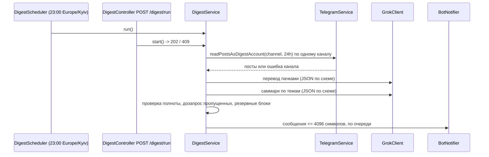

# Блок 10 — Дизайн

## Поток

## Единицы

| Файл | Ответственность |
|------|-----------------|
| `src/redis/redis.module.ts` | Провайдер клиента `ioredis` с явными опциями; `quit` при остановке; без `REDIS_URL` провайдер отдаёт `null` |
| `src/config/redis.config.ts` | `REDIS_URL`, `SESSION_ENCRYPTION_KEY` (32 байта, base64) |
| `src/shared/utils/secret-cipher.ts` | Чистые функции шифрования и расшифровки AES-256-GCM, хеш SHA-256 |
| `src/telegram/session-repository.ts` | Чтение, запись, продление, удаление зашифрованных сессий; отметка сессии дайджеста; режим «только память» |
| `src/telegram/session-store.ts` | При промахе кэша поднимает клиента из репозитория; `adopt` пишет в репозиторий; отвергнутая сессия удаляется и там |
| `src/telegram/telegram.service.ts` | `markDigestSession(sessionString)`, `readPostsAsDigestAccount(channel, hoursBack)` — строка сессии дайджеста не покидает модуль |
| `src/config/digest.config.ts` | Каналы, расписание, часовой пояс, Grok, бот |
| `src/digest/digest.module.ts` | Импортирует `TelegramModule`, `ScheduleModule` |
| `src/digest/digest.controller.ts` | `POST /digest/run`, `PUT /digest/session` |
| `src/digest/digest.scheduler.ts` | Регистрирует задачу через `SchedulerRegistry` с расписанием и поясом из конфигурации; останавливает её при остановке |
| `src/digest/digest.service.ts` | Оркестрация, одиночный запуск (флаг «идёт работа»), итоговая строка лога |
| `src/digest/post-collector.ts` | Каналы по одному, окно `DIGEST_WINDOW_HOURS`, сбор отказов каналов и флагов обрезки |
| `src/digest/grok/grok.client.ts` | HTTP-вызов Grok через `fetch`, таймаут, ограниченные повторы, разбор JSON-ответа |
| `src/digest/translation.service.ts` | Пачки по бюджету символов, проверка возврата каждого id, повтор для пропущенных, оригинал как резерв |
| `src/digest/summary.service.ts` | Саммари по темам, проверка полноты, дозапрос, резервные блоки |
| `src/digest/utils/coverage.ts` | Чистая функция: какие ссылки на посты отсутствуют, какие выдуманы |
| `src/digest/utils/digest-formatter.ts` | Чистое форматирование HTML и нарезка на сообщения по границам блоков |
| `src/digest/bot-notifier.ts` | `sendMessage` Bot API, по очереди, учёт `retry_after` до потолка |
| `src/digest/constants.ts` | Все пределы и таймауты блока |
| `src/digest/interfaces/` | `DigestPost`, `DigestTopic`, `DigestRunResult`, `DigestRunResponse` |

## Хранение сессий

| Ключ Redis | Значение | TTL |
|------------|----------|-----|
| `tg:session:{sha256}` | iv, тег и шифртекст строки сессии | `SESSION_STORE_TTL_S`, продлевается при использовании |
| `tg:digest-session` | `{sha256}` сессии дайджеста | без срока; сама сессия продлевается ежедневным запуском |

- Промах кэша: хеш строки → запись в Redis → расшифровка → сравнение с поданной строкой → `factory.create` → `connect` → кэш. Нет записи — 401.
- Ошибка расшифровки (сменился ключ) — запись удаляется, ответ 401.
- Redis недоступен — 503; кэш памяти продолжает обслуживать уже поднятые сессии.
- Все команды Redis ограничены `REDIS_COMMAND_TIMEOUT_MS`, повторы подключения — `REDIS_MAX_RETRIES`.

## Модель данных дайджеста

- `DigestPost`: `ref` (короткий `p1`, `p2`…), `channel`, `url`, `text` (оригинал), `translated`, `hasText`.
- `DigestTopic`: `thesis`, `viewpoints` (необязательный список `{ source, claim }` для противоположных версий), `refs`.
- Модель видит только `ref`, канал и текст; ссылки подставляет код по `ref`, модель их не пишет.

## Перевод

- Посты без текста в перевод и саммари не идут.
- Пачка ограничена `GROK_TRANSLATE_BATCH_CHARS`; текст поста для модели обрезается до `DIGEST_POST_MAX_CHARS`.
- Ответ — массив `{ ref, text }` по JSON-схеме; уже русский текст возвращается без изменений.
- Пропущенные `ref` дозапрашиваются один раз; оставшиеся берут оригинальный текст.

## Саммари и полнота

- Правила промпта: сухо, без оценок, без выводов; содержание поста принимается как утверждение источника; одна тема из разных каналов — один тезис; противоположные версии — `viewpoints` с указанием канала; каждый `ref` входа обязан встретиться хотя бы в одной теме; тезис короткий, одно предложение.
- Проверка кодом: `coverage.ts` сравнивает множества `ref`. Выдуманные `ref` отбрасываются. Пропущенные дозапрашиваются: модель получает текущие тезисы и пропущенные посты и возвращает, куда их добавить или какие новые темы создать. Не более `SUMMARY_COVERAGE_RETRIES` дозапросов.
- Гарантия: всё, что осталось пропущенным после дозапросов, становится отдельным блоком с первыми `DIGEST_FALLBACK_THESIS_CHARS` символами перевода. Итоговое число учтённых постов всегда равно числу собранных.
- Потолок входа: `DIGEST_MAX_POSTS` постов на запуск; при превышении старейшие не берутся, и это явно пишется в сообщении.

## Формат сообщения

- Заголовок: дата, число постов, число каналов.
- Блок: `• тезис`; при `viewpoints` — подпункты «канал: утверждение»; строка ссылок вида `@channel/63454` (якорь HTML на `url`).
- Отдельный блок «Посты без текста» со ссылками.
- Подвал: «Учтено N из N постов»; недоступные каналы; каналы с обрезкой по `POSTS_MAX_MESSAGES`; режим резерва перевода или саммари, если сработал.
- Весь текст экранируется под HTML Bot API; предпросмотр ссылок выключен.
- Нарезка по `BOT_MESSAGE_MAX_CHARS` только между блоками; одиночный блок длиннее предела режется по строкам.
- Нет постов за сутки — одно короткое сообщение об этом.

## Маршруты

| Маршрут | Вход | Ответ |
|---------|------|-------|
| `POST /digest/run` | `x-api-key` | 202 `{ status: 'started' }`; 409, если запуск идёт; 503, если дайджест не настроен |
| `PUT /digest/session` | `x-api-key`, `x-session-string` | 204; 400 без заголовка; 401, если сессия неизвестна или отвергнута |

Оба маршрута под глобальными `ApiKeyGuard` и `RateLimitGuard`.

## Отказы запуска

- Нет отмеченной сессии, сессия отвергнута, Grok или бот не настроены — запуск завершается, итог пишется одной строкой лога; если бот настроен — короткое сообщение об ошибке в бота.
- Канал недоступен — остальные каналы обрабатываются, канал попадает в подвал.
- Grok не ответил после повторов — в бота уходит резервный дайджест: переведённые (или оригинальные) посты списком без группировки, с пометкой.
- Ошибка отправки в бота после повторов — одна строка лога с кодом ответа, без текста сообщения и токена.

## Новые переменные окружения

`REDIS_URL`, `SESSION_ENCRYPTION_KEY`, `DIGEST_CHANNELS`, `DIGEST_CRON` (по умолчанию `0 23 * * *`), `DIGEST_TIMEZONE` (по умолчанию `Europe/Kyiv`), `GROK_API_KEY`, `GROK_MODEL`, `TELEGRAM_BOT_TOKEN`, `TELEGRAM_BOT_CHAT_ID`.

## Константы

`SESSION_STORE_TTL_S`, `REDIS_COMMAND_TIMEOUT_MS`, `REDIS_MAX_RETRIES`, `DIGEST_WINDOW_HOURS`, `DIGEST_MAX_CHANNELS`, `DIGEST_MAX_POSTS`, `DIGEST_POST_MAX_CHARS`, `DIGEST_FALLBACK_THESIS_CHARS`, `GROK_CALL_TIMEOUT_MS`, `GROK_MAX_RETRIES`, `GROK_TRANSLATE_BATCH_CHARS`, `SUMMARY_COVERAGE_RETRIES`, `BOT_MESSAGE_MAX_CHARS`, `BOT_CALL_TIMEOUT_MS`, `BOT_MAX_RETRY_AFTER_S`. Значения выбираются в фазах и описываются в `src/digest/constants.ts` и `src/telegram/constants.ts`.
